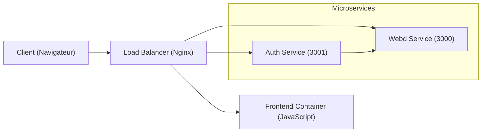

# Architecture du Système de Billetterie

Le présent système repose sur une **architecture microservices** destinée à la gestion d’événements et de tickets. Quatre conteneurs principaux constituent la base de ce projet :

Le schéma ci-dessus illustre le parcours d’une requête depuis le navigateur de l’utilisateur jusqu’aux différents services. Le **Load Balancer (lb)**, configuré via Nginx, reçoit l’ensemble du trafic sur le port 80 puis le redirige vers la bonne cible : le service d’authentification (Auth), le service de gestion principale (Webd) ou l’interface Frontend en JavaScript.

## Fonctionnement Global

### Auth Service (port 3001)
- **Rôles utilisateurs** : `Admin`, `EventCreator`, `User`, et `Basic`.
- Permet l’enregistrement (`/api/auth/register`) et la connexion (`/api/auth/login`) des utilisateurs.
- Gère la génération et la validation de **Jetons JWT** pour l’authentification.
- Stocke les utilisateurs dans sa propre base de données **SQLite**.  
- Gère la création d’un utilisateur admin par défaut (si configuré via variables d’environnement).

### Webd Service (port 3000)
- Concentre la logique métier : **CRUD d’événements**, achats de billets, gestion du stock de places.
- Interagit avec sa base de données **SQLite** indépendante pour **verrouiller** et mettre à jour les événements, évitant ainsi toute **sur-vente**.
- Implémente un mécanisme de **paiement simulé** par carte bancaire. Le numéro de carte doit contenir 16 chiffres, sinon la transaction est rejetée.
- Après l’achat d’un billet, déclenche un **envoi asynchrone** de confirmation (simulé : « email » ou « SMS ») pour informer l’utilisateur.
- Chaque opération critique (achat, mise à jour d’événement, etc.) est **loggée** et peut être déboguée grâce à Winston.

### Frontend
- Hébergé dans un conteneur **Nginx** distinct, qui sert des pages HTML/JS/CSS.
- Gère l’interface utilisateur en JavaScript, permettant :
  - De se connecter ou s’inscrire,
  - De consulter la liste des événements,
  - D’acheter des billets,
  - De gérer (créer, modifier, supprimer) des événements si le rôle est `Admin` ou `EventCreator`,
  - De gérer les utilisateurs si le rôle est `Admin`.
- Toutes les requêtes API du Frontend passent par le load balancer et sont dirigées ensuite vers `Auth` ou `Webd`.

### Load Balancer
- Basé sur **Nginx** (fichier `lb/nginx.conf`).
- Reçoit toutes les requêtes sur le port 80 et les redirige selon le chemin :
  - `/api/auth/...` vers le conteneur Auth (port 3001),
  - `/api/events/...`, `/api/tickets/...` vers Webd (port 3000),
  - le reste (y compris le site Web) vers le Frontend (port 80 interne).

## Choix Techniques

1. **Microservices** : Cette architecture évite la dépendance d’un gros monolithe et rend le système plus flexible et extensible. Chaque service peut être mis à l’échelle indépendamment (scale horizontal).
2. **Sécurité** : Les mots de passe sont chiffrés via **bcrypt** et chaque requête critique passe par un contrôle de rôle (Middleware JWT + vérification du `role`). Les tokens JWT sont vérifiés pour chaque endpoint sensible.
3. **Bases de données SQLite** : Simplifient la mise en place lors du développement. En production, un SGBD plus robuste (PostgreSQL, MySQL, etc.) peut remplacer ce stockage local.
4. **Verrouillage des places** : Afin de prévenir toute sur-vente, la transaction d’achat vérifie et met à jour le compteur `soldSeats` en verrouillant la ligne correspondant à l’événement.
5. **Confirmation asynchrone** : Lors de l’achat d’un billet, un minuteur simule l’envoi d’un message (SMS / e-mail). Cela illustre un process asynchrone que l’on pourrait lier à un message broker (RabbitMQ, Kafka, etc.) si besoin.
6. **Logging** : Chaque microservice utilise Winston pour générer des logs structurés (fichier `logger.js`). Ces logs sont primordiaux pour le diagnostic en cas d’erreur.

## Développement et Déploiement

1. **Docker Compose** : Un unique fichier `docker-compose.yml` orchestre tous les conteneurs (Auth, Webd, Frontend, LB).  
2. **Facilité de test** : Chaque microservice comporte des tests Jest (unitaires et d’intégration). Le script `run-tests.sh` permet d’exécuter ceux de `auth`, puis de `webd`, puis de `frontend`.  
3. **Scalabilité** : Dans un contexte de forte charge, on peut facilement dupliquer le conteneur `webd` et configurer le load balancer pour répartir les requêtes.

## Vision d’Ensemble

Grâce à l’architecture microservices et la configuration Nginx, le système satisfait les besoins suivants :

- **Créer, consulter, modifier et supprimer des événements**.
- **Gérer** plusieurs rôles d’utilisateurs, dont `Admin` (droits complets), `EventCreator` (ajout/édition d’événements), `User` (accès aux billets achetés), et `Basic` (accès minimal).
- **Acheter un billet** (paiement simulé, confirmation asynchrone, impossibilité de dépasser le nombre de places max).
- **Protéger les données utilisateurs** (mots de passe chiffrés, logs d’activité).
- **Contrôler** l’accès via un unique point d’entrée (Nginx), ce qui simplifie la maintenance.

Cette documentation reflète l’architecture finale telle qu’implémentée dans le projet.